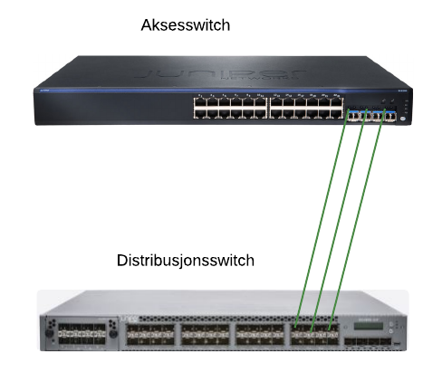

# Event script
Event scripts kjøres lokalt på Junos-enheten, og lytter til en "trigger". Når triggeren oppstår utfører event-scriptet en handling. Event-scriptene skrives i CLI-et til Junos.

# Eksempelbruksområde for event script
## Scenario
Du skal autoprovisjonere(Zero Touch Provisioning) en aksesswitch. Aksesswitchen vil fysisk være koblet med 3 linker i LAG mot en distribusjonsswitch. I en normaltilstand (operasjonelt fungerende oppsett) vil alle tre linkene mellom switchene være i ett LAG.

## Topologi

## Problemstilling
Når man plugger i en ny switch vil det være mismatch mellom LAG i distribusjonsswitchen sin ende, og singel aksessport i aksesswitchen sin ende. Det vil ikke gå å kommunisere, og Zero Touch Provisioning vil ikke fungere.

## Løsning
To eventscripts som kjører på distribusjonsswitchen.
* Eventscript #1 sjekker etter SNMP link down (generert av switchen selv) på LAG (AE)-interfacet. Når det blir link down på LAG-en så deaktiveres LAG-config på interface #1, og singel aksessportconfig aktiveres.
* Eventscript #2 sjekker etter SNMP link up (generert av switchen selv) på LAG (AE)-interfacet. Når det kommer link up (som vil si port 2 og/eller 3 har kontakt over LAG-en) så deaktiveres singel aksessportconfig på interface #1, og LAG-config aktiveres.

Se filen "eksempelconfig_distribusjon_lag.conf" for all nødvendig config.

Dette eksempelet er blitt brukt som en del av provisjoneringsløsningen brukt på The Gathering i 2015 og 2016.
