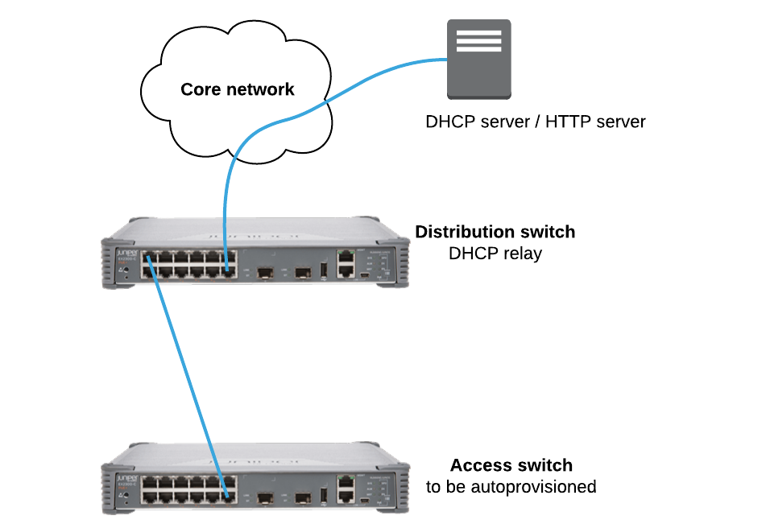

# Oppsett brukt på Juniper Network Day hos nLogic 2017-05-03

Her er en kjapp forklaring på filene. Utfyllende artikkel om oppsettet vil befinne seg på nLogic.no

## Topologi

## Filer
* __dhcpd.conf:__ ISC-DHCP-server sin config
* __index.php:__ PHP-fil som som leverer config til EX-en
* __distribution-config:__ Config på distribution switchen
* __ztp-config:__ Config som serveres til access-switchen via PHP (index.php)
